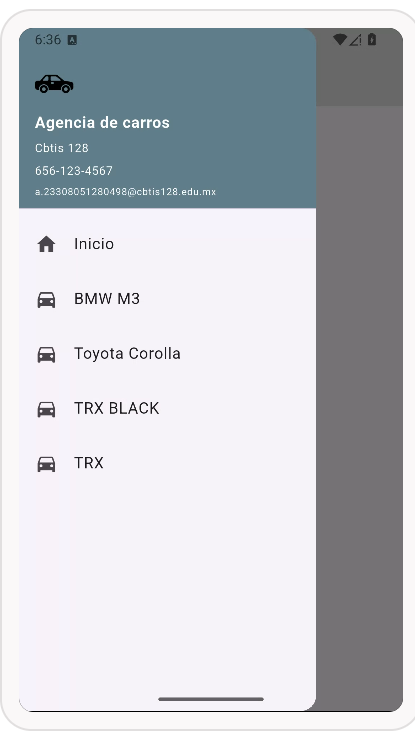
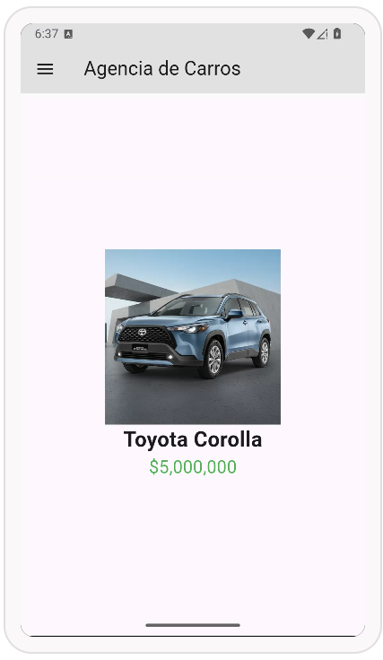
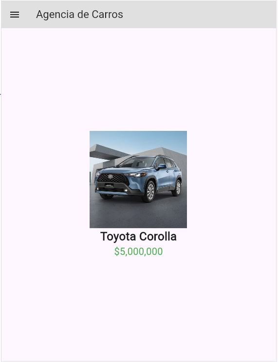
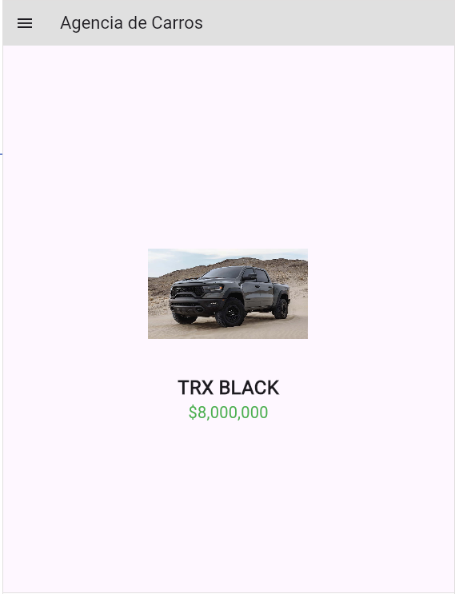

# myapp

# Prompt AI
Haremos un drawer de 4 opciones para una aplicacion movil, lo haremos en firebase, primero dame un codigo para probarlo en dartpad y despues de ese dame todo para firebase

Drawer:
Tendra un encabezado que constara de una imagen logo del negocio, con este link: https://raw.githubusercontent.com/GarciaValenciaJulian0498/UII_Act3_Drawer_Rutas_Nombradas/refs/heads/main/carros/logo.png, titulo:"Agencia de carros", direccion:"Cbtis 128", telefono: "656-123-4567", correo: "a.23308051280498@cbtis128.edu.mx", asegurate de que queden con un espaciado de 5px entre cada elemento, tendra un listile con iconos, texto y la accion para abrir la pagina a un archivo distinto .dart, los datos de cada pantalla te la dare mas adelante, antes de esos agregaras uno que diga inicio y mande al home

Paginas:
Cada pagina tendra una imagen de 200x200 centrada, con el nombre del carro y precio, debe tener un encabezado color gris claro que de texto diga "Agencia de Carros", cada pagina debe tener el boton para abrir el drawer y navegar

Rutas:
Estaran nombradas desde main.dart, crearemos una carpeta llamada "LasPaginas" para el resto de archivos

Carros:
BMW M3, https://raw.githubusercontent.com/GarciaValenciaJulian0498/UII_Act3_Drawer_Rutas_Nombradas/refs/heads/main/carros/bmw.jpg, $19,999,000
Toyota corolla, https://raw.githubusercontent.com/GarciaValenciaJulian0498/UII_Act3_Drawer_Rutas_Nombradas/refs/heads/main/carros/toyota.jpg, $5,000,000
TRX BLACK, https://raw.githubusercontent.com/GarciaValenciaJulian0498/UII_Act3_Drawer_Rutas_Nombradas/refs/heads/main/carros/trx.jpg, $8,000,000
TRX, https://raw.githubusercontent.com/GarciaValenciaJulian0498/UII_Act3_Drawer_Rutas_Nombradas/refs/heads/main/carros/trx1.jpg, $7,000,000

dame todos los archivos de cada pagina, no importa que solo sea cambiar pocas cosas, aun asi damelos, asegurate que el drawer tenga espaciado cada elemento para que no se amontone

# Android

# Web

